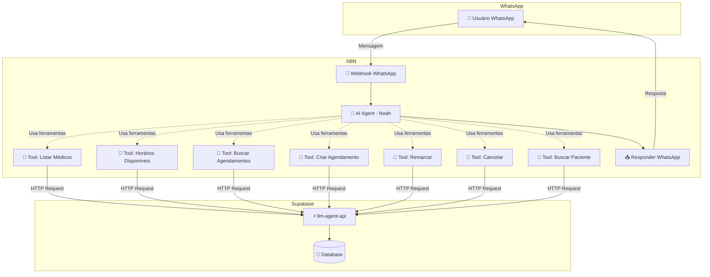
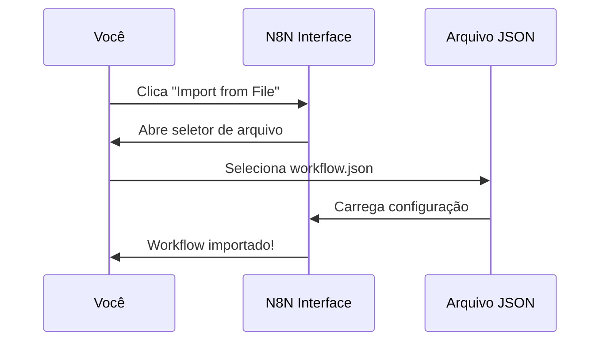
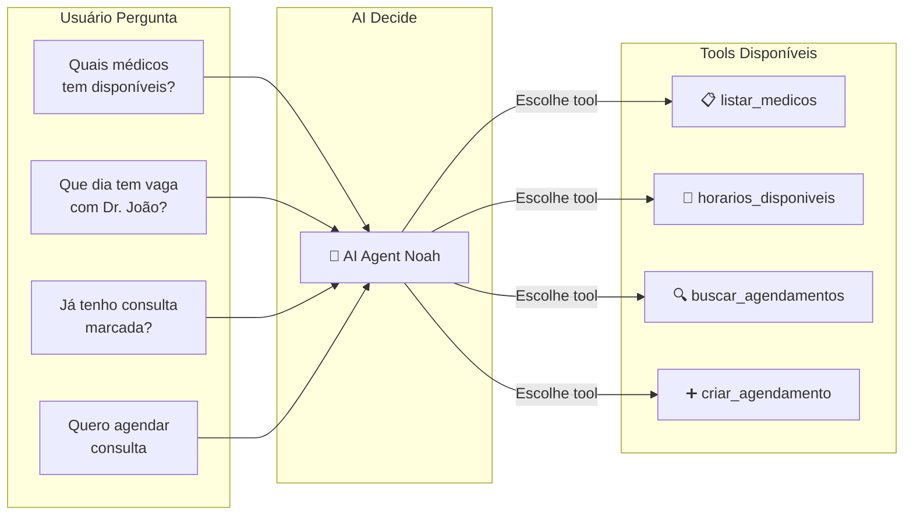
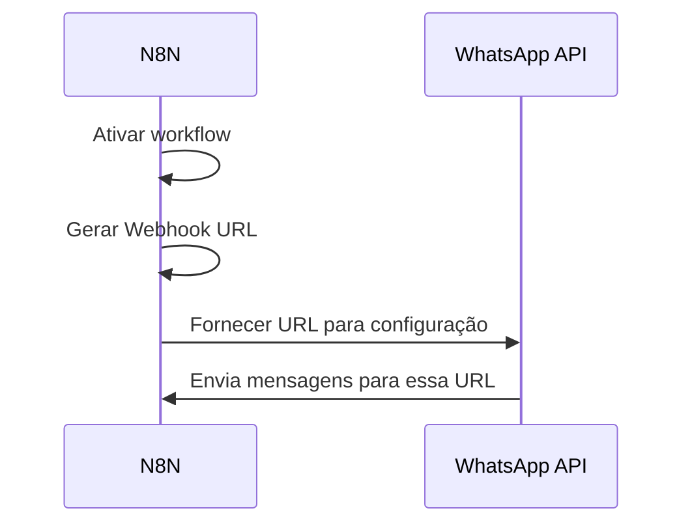
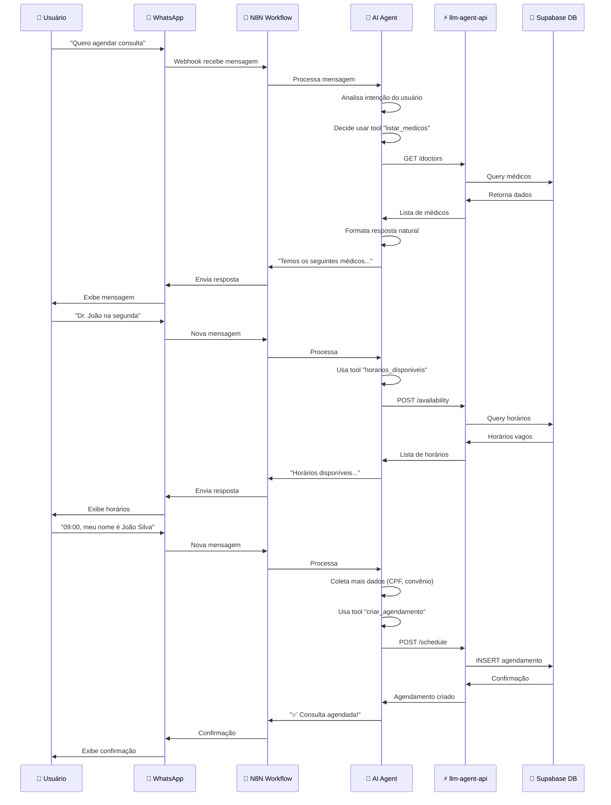

# 🎯 Tutorial Visual Completo - N8N WhatsApp Chatbot

> **Guia passo-a-passo com diagramas para configurar o chatbot conversacional**

---

## 📊 Visão Geral do Sistema



---

## ✅ Checklist de Configuração

- [ ] **Passo 1:** Obter credenciais Supabase
- [ ] **Passo 2:** Obter credencial OpenAI
- [ ] **Passo 3:** Importar workflow no N8N
- [ ] **Passo 4:** Configurar credenciais no N8N
- [ ] **Passo 5:** Configurar AI Agent com 7 tools
- [ ] **Passo 6:** Ativar workflow
- [ ] **Passo 7:** Configurar webhook no WhatsApp
- [ ] **Passo 8:** Testar o chatbot

---

## 🔑 PASSO 1: Obter Credenciais Supabase

### 1.1 Service Role Key

1. Acesse o [Supabase Dashboard](https://supabase.com/dashboard/project/qxlvzbvzajibdtlzngdy/settings/api)
2. Vá em **Settings** → **API**
3. Copie a `service_role key` (⚠️ **NUNCA** compartilhe essa chave!)

```
Formato da chave:
eyJhbGciOiJIUzI1NiIsInR5cCI6IkpXVCJ9...
```

### 1.2 URL da Edge Function

A URL base da API é:
```
https://qxlvzbvzajibdtlzngdy.supabase.co/functions/v1/llm-agent-api
```

---

## 🤖 PASSO 2: Obter Credencial OpenAI

1. Acesse [OpenAI Platform](https://platform.openai.com/api-keys)
2. Clique em **Create new secret key**
3. Copie a chave (começa com `sk-...`)

```
Formato da chave:
sk-proj-...
```

---

## 📥 PASSO 3: Importar Workflow no N8N

### 3.1 Download do Workflow

O arquivo está em: `docs/integracoes/n8n-whatsapp-chatbot-workflow.json`

### 3.2 Importar no N8N

1. Abra o N8N
2. Clique em **Menu** (≡) → **Import from File**
3. Selecione o arquivo `n8n-whatsapp-chatbot-workflow.json`
4. Clique em **Import**



---

## 🔧 PASSO 4: Configurar Credenciais no N8N

### 4.1 Criar Credencial Supabase

1. No N8N, clique em **Credentials** (menu lateral)
2. Clique em **+ Add Credential**
3. Busque por **"Header Auth"**
4. Configure:

```yaml
Credential Name: Supabase API Key
Header Name: Authorization
Value: Bearer SUA_SERVICE_ROLE_KEY_AQUI
```

⚠️ **IMPORTANTE:** O valor deve começar com `Bearer ` (com espaço)

### 4.2 Criar Credencial OpenAI

1. Clique em **+ Add Credential**
2. Busque por **"OpenAI"**
3. Configure:

```yaml
Credential Name: OpenAI API
API Key: sk-proj-SUA_CHAVE_AQUI
```

---

## 🤖 PASSO 5: Configurar AI Agent com Tools

Este é o passo mais importante! O AI Agent precisa das 7 ferramentas configuradas.

### 5.1 Abrir o Nó "AI Agent - Noah"

1. No workflow, clique no nó **"AI Agent - Noah"**
2. Vá na aba **"Tools"**
3. Clique em **"+ Add Tool"** 7 vezes (uma para cada ferramenta)

### 5.2 Configurar Tool 1: Listar Médicos

```yaml
Tool Type: Function
Name: listar_medicos
Description: Lista todos os médicos disponíveis com suas especialidades, horários e convênios aceitos

Parameters (JSON Schema):
{
  "type": "object",
  "properties": {
    "especialidade": {
      "type": "string",
      "description": "Filtrar por especialidade (opcional)"
    }
  }
}
```

**Conectar ao HTTP Request:**
- Method: `GET`
- URL: `https://qxlvzbvzajibdtlzngdy.supabase.co/functions/v1/llm-agent-api/doctors`
- Authentication: Usar credencial "Supabase API Key"

### 5.3 Configurar Tool 2: Listar Horários Disponíveis

```yaml
Tool Type: Function
Name: listar_horarios_disponiveis
Description: Retorna os horários vagos de um médico em uma data específica

Parameters (JSON Schema):
{
  "type": "object",
  "properties": {
    "medico_nome": {
      "type": "string",
      "description": "Nome do médico"
    },
    "data_consulta": {
      "type": "string",
      "description": "Data no formato YYYY-MM-DD"
    },
    "periodo": {
      "type": "string",
      "enum": ["manha", "tarde", "todos"],
      "description": "Período desejado"
    }
  },
  "required": ["medico_nome", "data_consulta"]
}
```

**Conectar ao HTTP Request:**
- Method: `POST`
- URL: `https://qxlvzbvzajibdtlzngdy.supabase.co/functions/v1/llm-agent-api/availability`
- Authentication: Usar credencial "Supabase API Key"
- Body: JSON com os parâmetros

### 5.4 Configurar Tool 3: Buscar Agendamentos do Paciente

```yaml
Tool Type: Function
Name: buscar_agendamentos_paciente
Description: Busca os agendamentos existentes de um paciente

Parameters (JSON Schema):
{
  "type": "object",
  "properties": {
    "nome_paciente": {
      "type": "string",
      "description": "Nome do paciente"
    },
    "data_nascimento": {
      "type": "string",
      "description": "Data de nascimento YYYY-MM-DD (opcional)"
    },
    "telefone": {
      "type": "string",
      "description": "Telefone do paciente (opcional)"
    }
  },
  "required": ["nome_paciente"]
}
```

**Conectar ao HTTP Request:**
- Method: `POST`
- URL: `https://qxlvzbvzajibdtlzngdy.supabase.co/functions/v1/llm-agent-api/check-patient`
- Authentication: Usar credencial "Supabase API Key"

### 5.5 Configurar Tool 4: Criar Agendamento

```yaml
Tool Type: Function
Name: criar_agendamento
Description: Cria um novo agendamento para o paciente

Parameters (JSON Schema):
{
  "type": "object",
  "properties": {
    "nome_paciente": {
      "type": "string",
      "description": "Nome completo do paciente"
    },
    "data_nascimento": {
      "type": "string",
      "description": "Data de nascimento YYYY-MM-DD"
    },
    "telefone": {
      "type": "string",
      "description": "Telefone do paciente"
    },
    "convenio": {
      "type": "string",
      "description": "Nome do convênio"
    },
    "medico_nome": {
      "type": "string",
      "description": "Nome do médico"
    },
    "atendimento_nome": {
      "type": "string",
      "description": "Nome do tipo de atendimento/exame"
    },
    "data_consulta": {
      "type": "string",
      "description": "Data da consulta YYYY-MM-DD"
    },
    "hora_consulta": {
      "type": "string",
      "description": "Hora da consulta HH:MM"
    }
  },
  "required": ["nome_paciente", "data_nascimento", "telefone", "convenio", "medico_nome", "data_consulta", "hora_consulta"]
}
```

**Conectar ao HTTP Request:**
- Method: `POST`
- URL: `https://qxlvzbvzajibdtlzngdy.supabase.co/functions/v1/llm-agent-api/schedule`
- Authentication: Usar credencial "Supabase API Key"

### 5.6 Configurar Tool 5: Remarcar Agendamento

```yaml
Tool Type: Function
Name: remarcar_agendamento
Description: Remarca um agendamento existente para nova data/hora

Parameters (JSON Schema):
{
  "type": "object",
  "properties": {
    "agendamento_id": {
      "type": "string",
      "description": "ID do agendamento a remarcar"
    },
    "nova_data": {
      "type": "string",
      "description": "Nova data YYYY-MM-DD"
    },
    "nova_hora": {
      "type": "string",
      "description": "Nova hora HH:MM"
    }
  },
  "required": ["agendamento_id", "nova_data", "nova_hora"]
}
```

**Conectar ao HTTP Request:**
- Method: `POST`
- URL: `https://qxlvzbvzajibdtlzngdy.supabase.co/functions/v1/llm-agent-api/reschedule`
- Authentication: Usar credencial "Supabase API Key"

### 5.7 Configurar Tool 6: Cancelar Agendamento

```yaml
Tool Type: Function
Name: cancelar_agendamento
Description: Cancela um agendamento existente

Parameters (JSON Schema):
{
  "type": "object",
  "properties": {
    "agendamento_id": {
      "type": "string",
      "description": "ID do agendamento a cancelar"
    },
    "motivo": {
      "type": "string",
      "description": "Motivo do cancelamento"
    }
  },
  "required": ["agendamento_id"]
}
```

**Conectar ao HTTP Request:**
- Method: `POST`
- URL: `https://qxlvzbvzajibdtlzngdy.supabase.co/functions/v1/llm-agent-api/cancel`
- Authentication: Usar credencial "Supabase API Key"

### 5.8 Configurar Tool 7: Buscar Paciente

```yaml
Tool Type: Function
Name: buscar_paciente
Description: Busca informações de um paciente no sistema

Parameters (JSON Schema):
{
  "type": "object",
  "properties": {
    "nome": {
      "type": "string",
      "description": "Nome do paciente (parcial ou completo)"
    },
    "telefone": {
      "type": "string",
      "description": "Telefone do paciente (opcional)"
    },
    "data_nascimento": {
      "type": "string",
      "description": "Data de nascimento YYYY-MM-DD (opcional)"
    }
  },
  "required": ["nome"]
}
```

**Conectar ao HTTP Request:**
- Method: `POST`
- URL: `https://qxlvzbvzajibdtlzngdy.supabase.co/functions/v1/llm-agent-api/patient-search`
- Authentication: Usar credencial "Supabase API Key"

---

## 🔄 Diagrama de Fluxo das Tools



---

## ✅ PASSO 6: Ativar Workflow

1. Salve todas as configurações
2. Clique no botão **"Active"** no topo do workflow
3. O workflow ficará com status **🟢 Active**

### Obter URL do Webhook

1. Clique no nó **"Webhook WhatsApp"**
2. Copie a **"Webhook URL"** que aparece
3. Formato: `https://seu-n8n.com/webhook/whatsapp-chatbot`



---

## 📱 PASSO 7: Configurar Webhook no WhatsApp

### 7.1 Evolution API

Se você usa Evolution API:

1. Acesse o painel do Evolution API
2. Vá em **Webhooks** → **Configure**
3. Cole a URL do webhook do N8N
4. Ative os eventos:
   - ✅ `messages.upsert` (mensagens recebidas)
   - ✅ `messages.update` (atualizações)

### 7.2 WhatsApp Business API

Se você usa WhatsApp Business API oficial:

1. Acesse o [Meta Developer Console](https://developers.facebook.com/)
2. Vá em seu app → **WhatsApp** → **Configuration**
3. Em **Webhooks**, adicione a URL do N8N
4. Subscribe aos eventos de mensagens

---

## 🧪 PASSO 8: Testar o Chatbot

### Teste 1: Listar Médicos

**Envie no WhatsApp:**
```
Olá! Quais médicos vocês têm disponíveis?
```

**Resposta Esperada:**
```
Olá! Temos os seguintes médicos disponíveis:

👨‍⚕️ Dr. João Silva - Gastroenterologista
📅 Horários: Segunda a Sexta
💳 Convênios: Unimed, Particular

👩‍⚕️ Dra. Maria Santos - Endoscopista
📅 Horários: Terça e Quinta
💳 Convênios: Unimed, SulAmérica

Como posso te ajudar?
```

### Teste 2: Verificar Horários

**Envie no WhatsApp:**
```
Que dia tem vaga com Dr. João na próxima semana?
```

**Resposta Esperada:**
```
Verificando horários do Dr. João Silva...

📅 Horários disponíveis para próxima semana:

Segunda (15/01):
• 09:00
• 10:30
• 14:00
• 15:30

Terça (16/01):
• 08:30
• 11:00
• 13:30

Qual horário prefere?
```

### Teste 3: Criar Agendamento

**Envie no WhatsApp:**
```
Quero agendar para segunda às 09:00
```

**AI irá perguntar:**
```
Perfeito! Vou precisar de algumas informações:

1️⃣ Qual seu nome completo?
2️⃣ Qual sua data de nascimento?
3️⃣ Qual seu convênio?
4️⃣ Qual seu telefone de contato?
```

**Após fornecer os dados:**
```
✅ Consulta agendada com sucesso!

📋 Detalhes do agendamento:
👤 Paciente: João da Silva
👨‍⚕️ Médico: Dr. João Silva
📅 Data: 15/01/2025 às 09:00
💳 Convênio: Unimed
📞 Contato: (11) 98765-4321

Você receberá lembretes antes da consulta.
Alguma outra coisa que eu possa ajudar?
```

---

## 🐛 Troubleshooting

### ❌ Problema: "Webhook não está recebendo mensagens"

**Soluções:**
1. Verifique se o workflow está **Active** (🟢)
2. Teste a URL do webhook diretamente:
   ```bash
   curl -X POST https://seu-n8n.com/webhook/whatsapp-chatbot \
     -H "Content-Type: application/json" \
     -d '{"message": "teste"}'
   ```
3. Verifique os logs no N8N (**Executions**)

### ❌ Problema: "AI não está chamando as tools"

**Soluções:**
1. Verifique se todas as 7 tools estão configuradas no AI Agent
2. Confirme que cada tool tem `name`, `description` e `parameters`
3. Teste o AI Agent isoladamente enviando uma mensagem manual
4. Verifique os logs do OpenAI (pode ter atingido limite de quota)

### ❌ Problema: "Erro 401 Unauthorized na API"

**Soluções:**
1. Verifique se a credencial Supabase está correta
2. Confirme que o valor tem `Bearer ` antes da chave
3. Teste a chave manualmente:
   ```bash
   curl https://qxlvzbvzajibdtlzngdy.supabase.co/functions/v1/llm-agent-api/doctors \
     -H "Authorization: Bearer SUA_CHAVE_AQUI"
   ```

### ❌ Problema: "AI responde mas não executa ações"

**Soluções:**
1. Verifique se os HTTP Request nodes estão conectados corretamente
2. Confirme que os parâmetros JSON Schema estão corretos
3. Verifique os logs do Supabase Edge Function
4. Teste cada endpoint individualmente

---

## 📊 Diagrama Completo do Fluxo



---

## 🎯 Checklist Final

Antes de considerar concluído, verifique:

- [ ] ✅ Todas as 7 tools configuradas no AI Agent
- [ ] ✅ Credenciais Supabase e OpenAI configuradas
- [ ] ✅ Workflow ativo (🟢 Active)
- [ ] ✅ Webhook URL configurado no WhatsApp
- [ ] ✅ Teste de listagem de médicos funcionando
- [ ] ✅ Teste de horários disponíveis funcionando
- [ ] ✅ Teste de criação de agendamento funcionando
- [ ] ✅ Logs do N8N sem erros
- [ ] ✅ Logs do Supabase sem erros

---

## 📚 Recursos Adicionais

### Documentação Relacionada

- 📄 [N8N Setup Completo](./n8n-setup-completo.md)
- 📄 [N8N Setup Rápido](./n8n-setup-rapido.md)
- 📄 [LLM Agent API Guide](./n8n-llm-whatsapp-guide.md)
- 📄 [Workflow JSON](./n8n-whatsapp-chatbot-workflow.json)

### Links Úteis

- [N8N Documentation](https://docs.n8n.io/)
- [OpenAI API Docs](https://platform.openai.com/docs)
- [Supabase Edge Functions](https://supabase.com/docs/guides/functions)
- [Evolution API Docs](https://doc.evolution-api.com/)

---

## 💡 Dicas Profissionais

1. **Monitore os logs:** Configure alertas para erros no N8N
2. **Teste regularmente:** Crie testes automatizados para cada tool
3. **Backup do workflow:** Exporte o JSON regularmente
4. **Otimize prompts:** Ajuste o system message para melhor performance
5. **Rate limits:** Monitore uso da API OpenAI para evitar surpresas

---

## 🎉 Pronto!

Seu chatbot conversacional está configurado! 

Agora os usuários podem:
- ✅ Consultar médicos disponíveis
- ✅ Verificar horários vagos
- ✅ Agendar consultas
- ✅ Remarcar agendamentos
- ✅ Cancelar consultas
- ✅ Verificar agendamentos existentes

**Tudo isso de forma natural, conversando com o AI Agent! 🚀**

---

**Precisa de ajuda?** Entre em contato com o suporte técnico.
